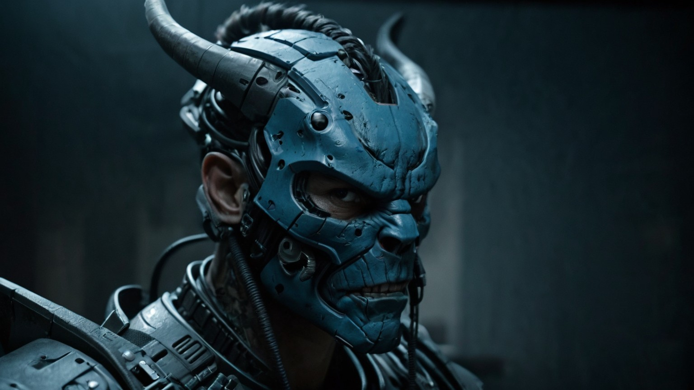

# Professional Context and Growth

This document provides context around the technical work documented in this repository.

It exists to explain how this issue was discovered, why it mattered, and what operating at the edge of a platform teaches when real workloads intersect with experimental systems.

---

## How This Was Discovered

This regression was not discovered through deliberate stress testing.

It was discovered when routine work stopped working.

A screenshot failed.
An image would not open.
A tool that normally functions without thought suddenly didn’t.

That moment was the signal.

---

## Why That Signal Matters

Screenshot capture and image viewing sit at the far end of the graphics and media pipeline.

When they fail after compute workloads succeed, it indicates:

- The application layer is not the problem
- The workload itself was valid
- The failure lives deeper in shared runtime paths

This is how edge regressions surface in real systems: quietly, indirectly, and often through mundane actions.

---

## Operating at the Edge

Working on experimental platforms means accepting that:

- Stability is not guaranteed
- Failures may appear far from the triggering workload
- Recovery literacy matters as much as performance

Rather than panic or assume corruption, the correct response is to observe, verify, document, and recover responsibly.

---

## Growth Through Instability

Coming into systems work through non-traditional paths changes how instability is perceived.

Instead of treating failure as disruption, it becomes data.

Instead of assuming the platform is wrong, assumptions are tested.

Instead of chasing fixes, behavior is documented.

That mindset turns unstable systems into accelerated learning environments.

---

## Why This Work Matters

This repository is not about a single bug.

It is about:
- Understanding how platforms behave under real pressure
- Learning how experimental systems fail
- Developing the discipline to recover without causing harm
- Building confidence operating near system boundaries

These skills compound over time.

---

## Demonstrating Growth Through Improved Outputs

Following recovery, re-baselining, and a more disciplined approach to workload management, subsequent inference runs produced consistently clean and coherent outputs.

These images are included to demonstrate **improved execution quality**, not to showcase artistic preference.

They were generated under comparable conditions, using the same model family and tooling, but with greater attention to runtime health, session boundaries, and system state.

---

### Representative Post-Recovery Outputs

The following images were produced after the regression was understood and mitigated.

They exhibit:
- Stable composition
- Consistent detail fidelity
- No visible corruption artifacts
- Predictable output behavior across runs

#### Example A

#### Example B

#### Example C

#### Example D

#### Example E

#### Example F
  

#### Example G

#### Example H

#### Example I

#### Example J

#### Example K

#### Example L

#### Example M
  

#### Example N

#### Example O

#### Example P

#### Example Q

---

## Why This Contrast Matters

The difference between pre-regression artifacts and post-recovery outputs is not aesthetic.

It reflects:
- Improved runtime hygiene
- Better control of long-lived GPU contexts
- Awareness of cumulative system state
- Discipline in operating near platform limits

This is the practical outcome of learning how systems fail — and how to work responsibly once they do.

The goal is not perfection.

The goal is **predictability, stability, and understanding**.

---

## Closing Thought

Bleeding-edge platforms do not reward comfort.

They reward curiosity, restraint, and documentation.

This work represents that intersection.
